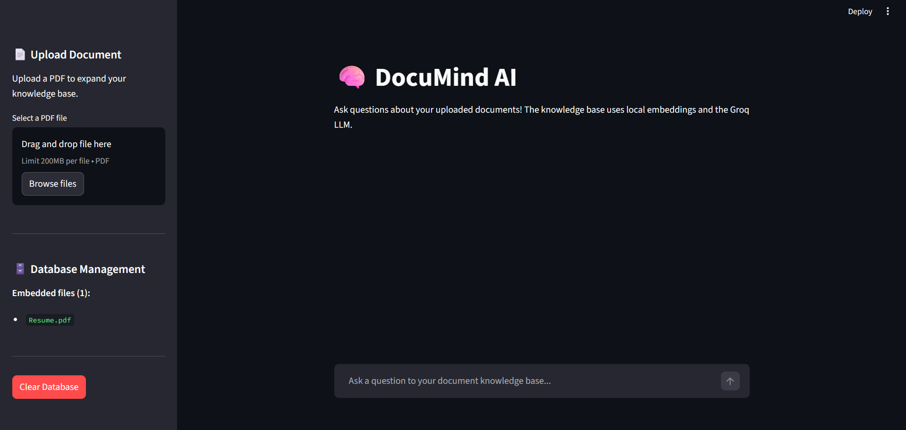

# DocuMind AI 🧠

DocuMind is an intelligent Retrieval-Augmented Generation (RAG) application that allows you to chat with your local documents using a powerful mixture of local embedding models and cloud-based LLM inference.


## 🏗️ Architecture

DocuMind is built with the following core technologies over a Dockerized setup:
* **Embeddings Model**: `all-MiniLM-L6-v2` via HuggingFace (runs completely locally). This gives us privacy and speed for standard document ingestion without generating per-token API fees for the retrieval phase.
* **Vector Database**: **ChromaDB** running inside a container. It persistently stores all the embedded document chunks so they can be securely and efficiently retrieved by the backend.
* **Backend Application**: A fast and lightweight backend built on **FastAPI**. It exposes the semantic search endpoints and coordinates the integration via Langchain pipelines linking retriever to the LLM.
* **Frontend**: A clean, streamlined chat interface powered by **Streamlit**.
* **LLM Engine**: **Groq**. We use Groq to power high-speed generation of the answer text via Langchain's integration (i.e., `ChatGroq`).

## 🚀 Getting Started

### Prerequisites
Make sure you have:
* **Docker** installed
* **Docker Compose**
* **Python 3.10+** (if running UI or worker scripts natively)

### Step 1: Obtain a Groq API Key
Since this project uses Groq's fast LLM capabilities to synthesize context and write final answers, you will need a valid `GROQ_API_KEY`:

1. Visit [Groq Cloud Console](https://console.groq.com/).
2. Sign in with your account or create a new one.
3. Access the API Keys section from the left navigation pane.
4. Click on **Create API Key**.
5. Copy the newly generated key.

### Step 2: Environment Configuration
Create a `.env` file at the root of the project with the copied key:

```bash
GROQ_API_KEY=your_copied_api_key_here
```

### Step 3: Start the Backend and Database Services
Build and start your Docker containers:
```bash
docker-compose up -d --build
```
This will start the **ChromaDB** container at `localhost:8001` and the **FastAPI Backend** inside the `documind-backend` container at `localhost:8000`.

### Step 4: Launch the Chat UI
Launch the local frontend to begin questioning your repository knowledge base:

```bash
streamlit run ui.py
```

### Step 5: Ingest documents from the UI
Once the Streamlit interface boots up in your browser, you can easily load context into your Chroma vector database directly from the application!
1. Look at the **Upload Document** section on the left sidebar.
2. Select your target `.pdf` file.
3. Click **Upload and Embed**.
4. You can freely monitor your successfully embedded documents in the **Database Management** section and clear your database if you want to start fresh!

Enjoy chatting with your local documents!
